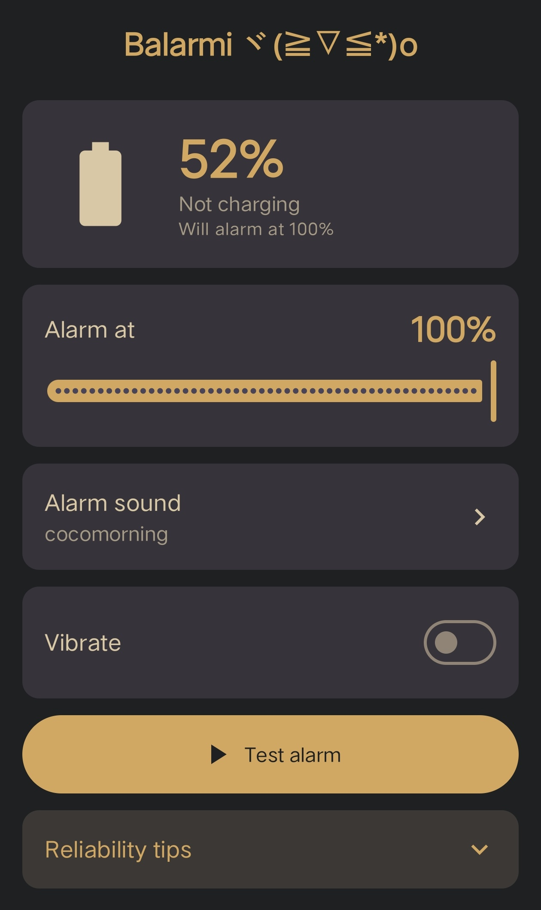

# Balarmi (Battery Alarm)

An Android app designed to monitor your device's battery level during charging and trigger an alarm once a specified target charge is reached.

The app starts only when the user opens it and closes automatically when the cable is removed.

[Download](https://github.com/petchvm/Balarmi/releases/download/v2.1/Balarmi.apk)

> Requires Android 8.0 (Oreo) or newer.
